# Medellin

## Framework
Meteor JS

## Module
Donation Module — AdDU Nation Alumni Hub (Web)

---

## About the Project
A fully realized desktop web application for the **Ateneo de Davao University Alumni Hub**, featuring a Donation Module that allows alumni to browse campaigns, donate to student projects, pledge recurring contributions, and view their impact. The app also includes an Admin/Staff Portal for reviewing and approving campaigns.

---

## AI Tools Used
- **Gemini Pro** (Google)

---

## Prompt

> *The following prompt was used with Gemini Pro along with an attached PDF of the mobile app design from Activity #10:*

**First & Main Prompt:**
> "Hello! Transform the provided mobile PDF design (DONATION.pdf) into a fully  desktop website design.
>
> Requirements:
> 1. Replicate all screens, features, and functions found in the PDF. Ensure that nothing is omitted from the original design. Adapt mobile interactions into desktop-friendly layouts and behaviors.
> 2. Create a modern, professional, and high-end look. The website should feel like it was made by a prestigious academic institution. Maintain a clean, organized, and polished layout.
> 4. Incorporate Filipino inspired design elements, such as traditional patterns or motifs. Ensure cultural elements are tasteful, minimal, and integrated elegantly into the UI (not overwhelming).
> 5. Improve usability where needed to better suit desktop experiences. Ensure responsiveness.
> 6. Therefore, I want a complete desktop website design system (all pages/screens included). Consistent styling across all components."

> **File Attachment Used:** [DONATION.pdf](screenshots&pdf/DONATION.pdf)
---

## Installation

Follow these steps exactly to run this project on a brand new Windows PC.

### Step 1 — Install Node.js

1. Open your browser and go to: **https://nodejs.org**
2. Click the **"LTS"** version button (recommended for most users) to download the installer.
3. Open the downloaded `.msi` file and run the installer.
4. Click **Next** through all the steps and keep all default settings selected.
5. When the installation is complete, click **Finish**.
6. Verify Node.js was installed correctly:
   - Press `Windows Key + R`, type `cmd`, and press Enter to open Command Prompt.
   - Type the following and press Enter:
     ```
     node -v
     ```
   - You should see a version number like `v20.x.x`. If you do, Node.js is installed.
   - Also type:
     ```
     npm -v
     ```
   - You should see another version number. This confirms npm is also ready.

---

### Step 2 — Install Git

1. Go to: **https://git-scm.com/download/win**
2. Download the installer and run it.
3. Click **Next** through all steps, keeping all default settings.
4. Click **Finish** when done.
5. Verify Git is installed:
   - Open Command Prompt and type:
     ```
     git --version
     ```
   - You should see something like `git version 2.x.x`.

---

### Step 3 — Clone the Repository

1. Open Command Prompt.
2. Navigate to the folder where you want to save the project. For example, to save it on your Desktop:
   ```
   cd Desktop
   ```
3. Clone the repository by typing:
   ```
   git clone https://github.com/YOUR_GITHUB_USERNAME/firstattempt2026_medellin.git
   ```
   *(Replace the URL with your actual repository URL)*
4. Enter the project folder:
   ```
   cd firstattempt2026_medellin
   ```

---

### Step 4 — Run the Project

1. Inside the project folder, open Command Prompt and type:
   ```
   npm start
   ```
2. Wait for the app to finish loading. You will see a message that it is running.
3. Open your browser (Google Chrome or Microsoft Edge recommended) and go to:
   ```
   localhost:3000
   ```
4. The application will load in your browser.

---

## Screenshots

**Screenshot 1 — Login Page**
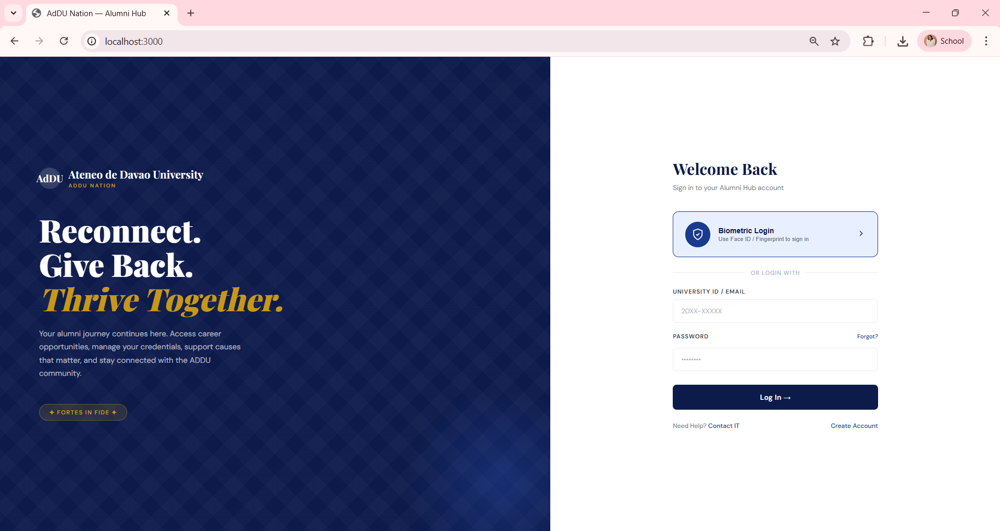

**Screenshot 2 — Academic Passport**
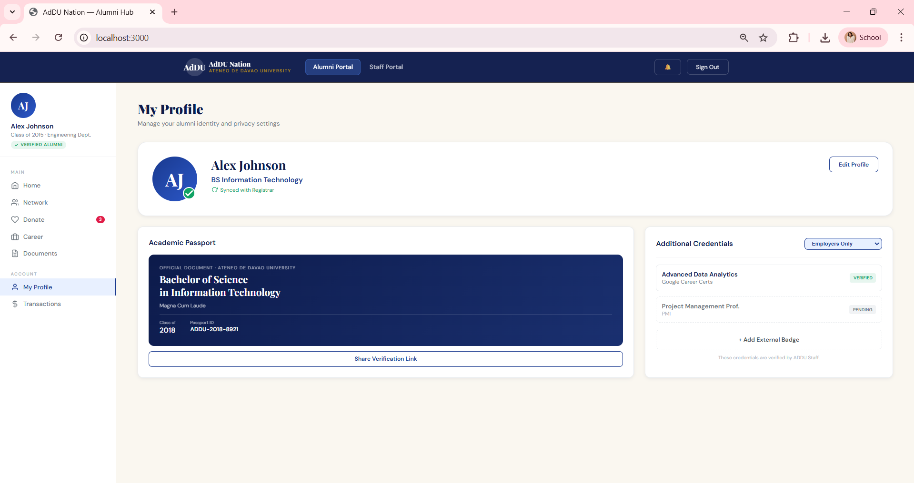

**Screenshot 3 — Discover & Create Fundraisers)**
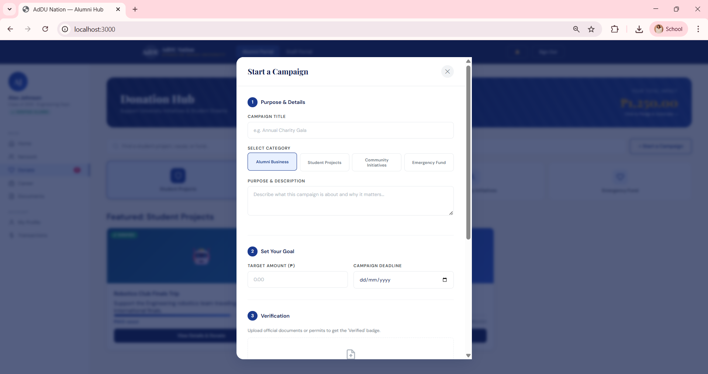

**Screenshot 4 — Pledge & Automate**
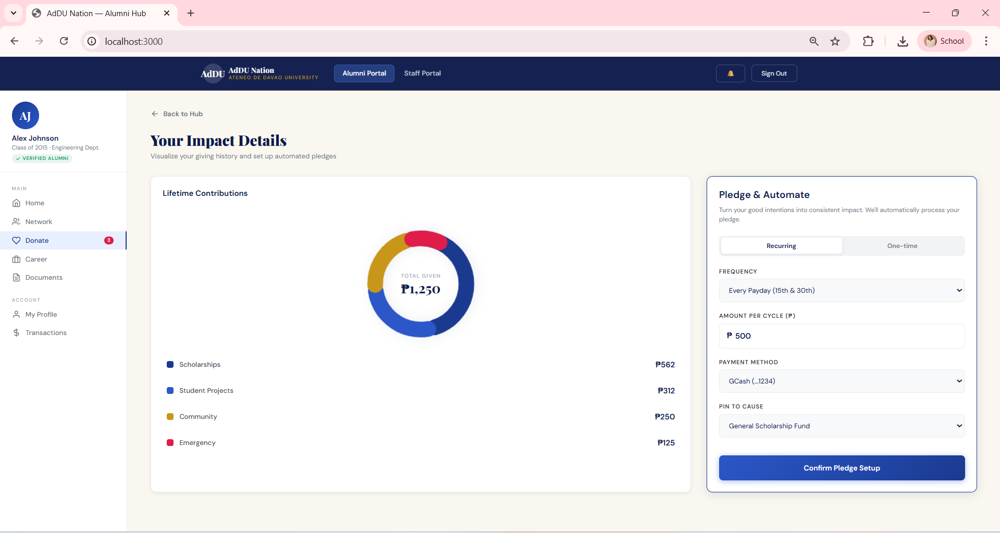

**Screenshot 5 — Student Project Donation**
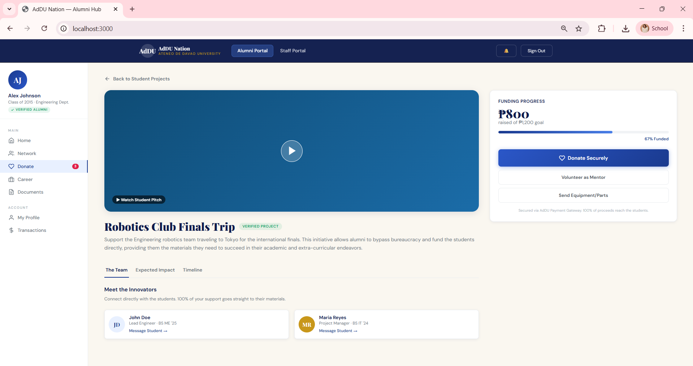

**Screenshot 6 — Transaction History**
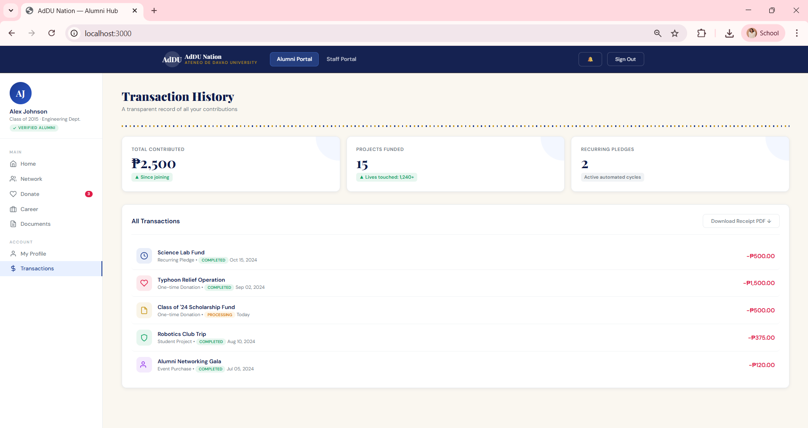

**Screenshot 7 — Emergency Donation**
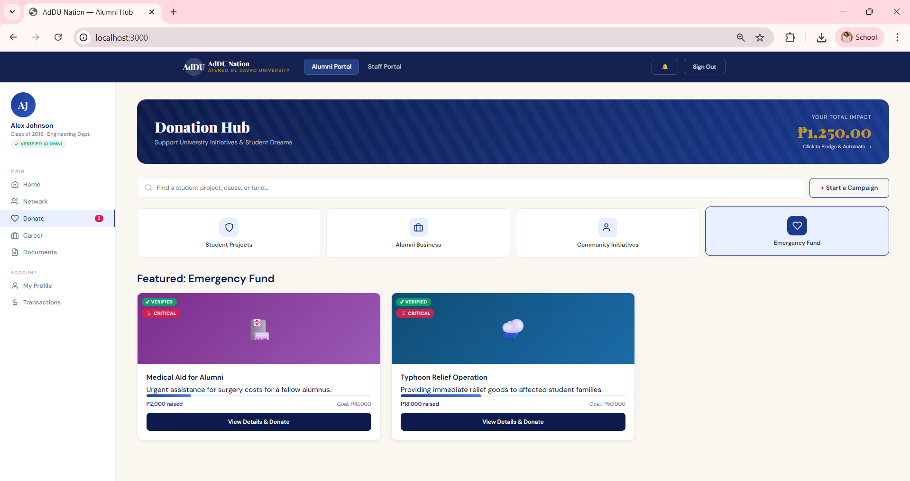

**Screenshot 8 — Admin Portal — Queue**
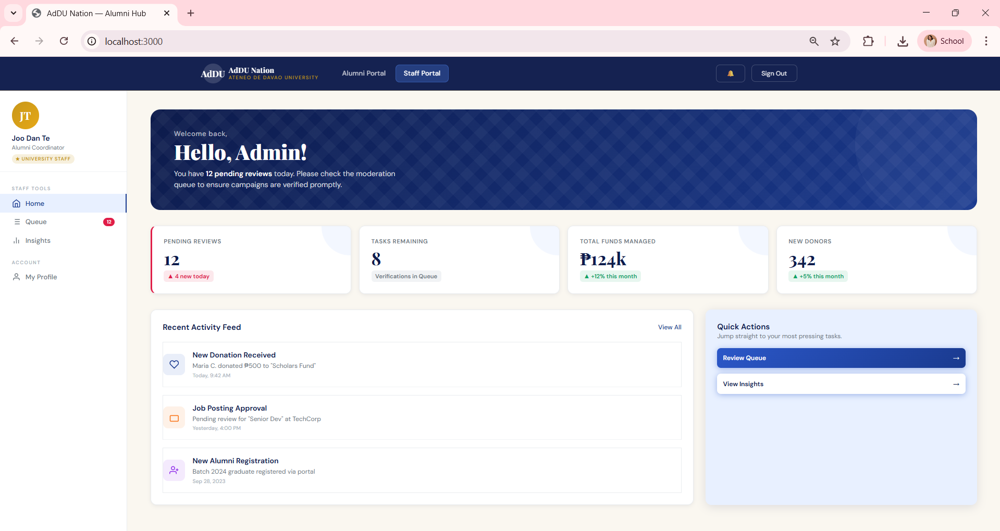
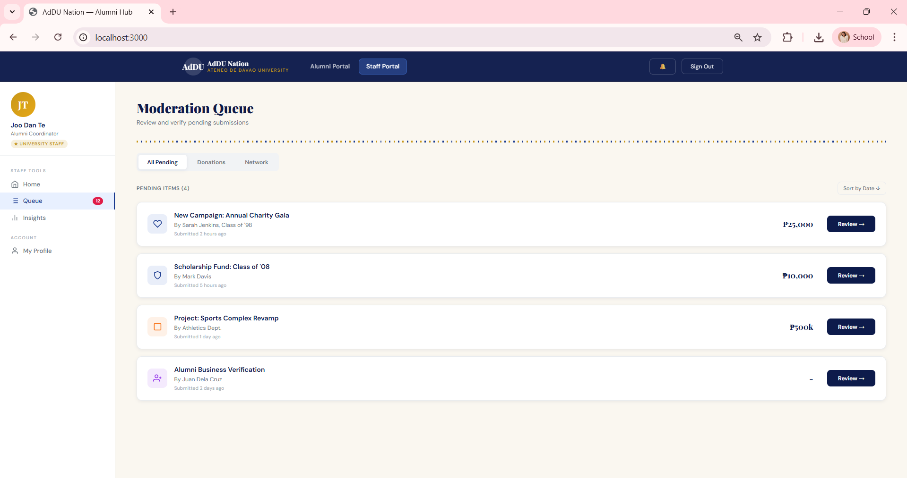

**Screenshot 9 — Review for Verification**
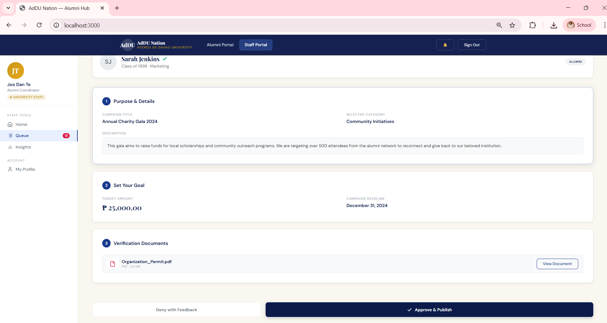

**Screenshot 10 — Donation Insights**
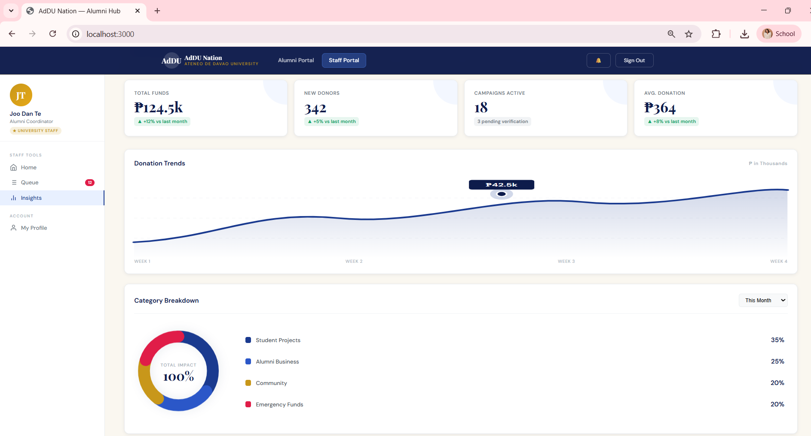

**Screenshot 11 — Alumni Coordinator Profile**
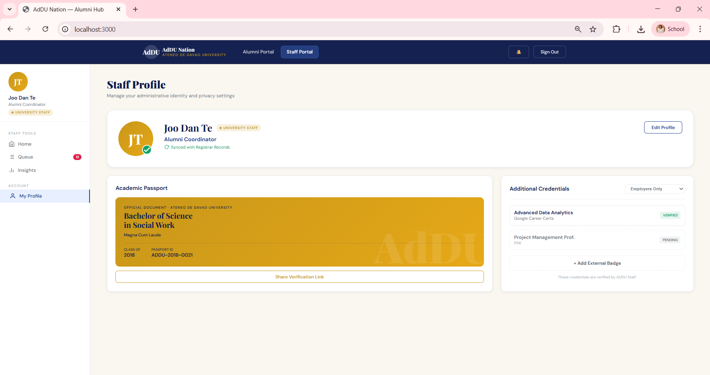

---

*Ateneo de Davao University · AdDU Nation Alumni Hub · 2026*
